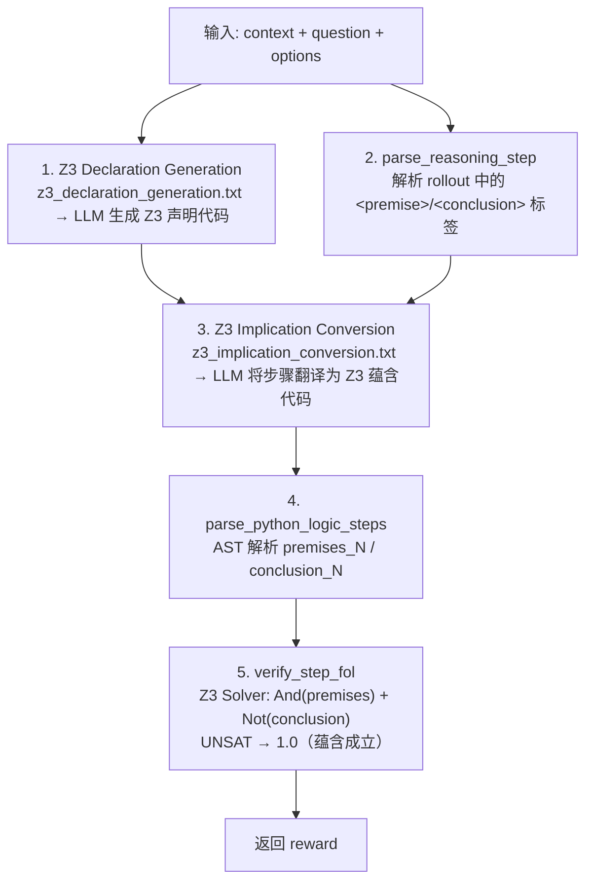
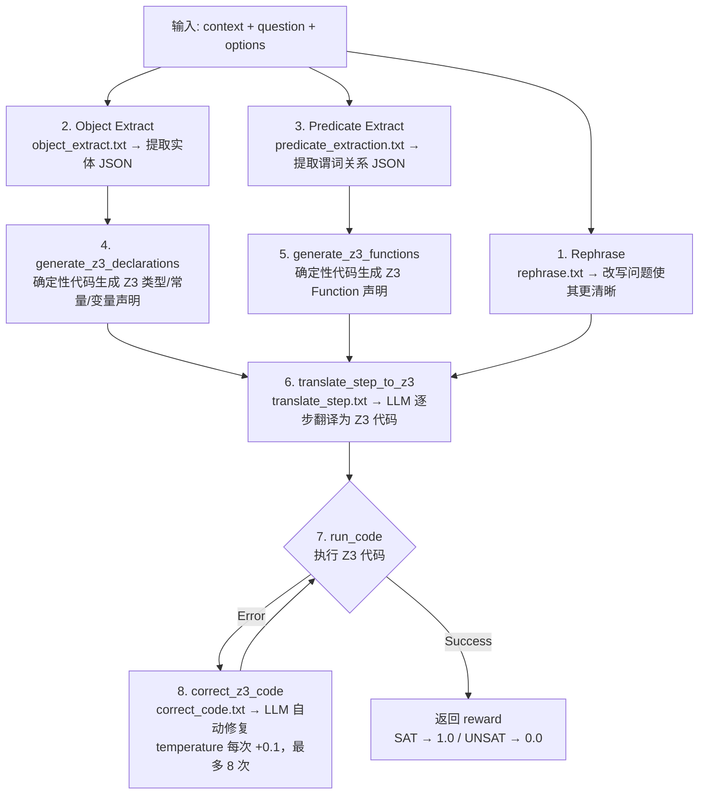
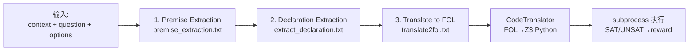

# verl: Volcano Engine Reinforcement Learning for LLMs (Forked)

This is a customized fork of [verl](https://github.com/volcengine/verl) tailored for logical reasoning tasks, process reward-based reinforcement learning methods (Step-GDPO, parallel generation or tree search), and specialized dataset preprocessing pipelines & prompting for LogiQA datasets.

For the original verl library's detailed documentation and features, please refer to [README-bytedance.md](README-bytedance.md).

---

## LogiQA Dataset Preprocessing & Prompting

The LogiQA dataset preprocessing allows injecting custom reasoning instructions (e.g., `p1 & p2 -> i1` for step-wise logical inferences) via flexible prompt file configurations.

### Version, Format, # of samples, and Output Directory

You can customize the LogiQA dataset loading and preprocessing by configuring a few parameters in `logiqa.py`:

- `--version`: Specifies LogiQA dataset version (`1` for `lucasmccabe/logiqa` or `2` for `baber/logiqa2`). Default is `1`.
- `--num_samples`: The number of training samples to keep. Use `-1` for all samples. Default is `2000`.
- `--local_save_dir`: The directory to save the output `.parquet` files. Default is `./data/logiqa2k`.
- `--format`: Prompt formatting style. Default is `flat`.
  - `flat`: Regular plain text format (`Context: ...\n\nQuestion: ...\n\nOptions: ...`).
  - `xml`: XML tag format (`<Context>...\n</Context>\n<Question>...`).

**Example:**

Version 1, 2000 samples, XML text format (the used version)

```bash
python examples/data_preprocess/logiqa.py \
    --version 1 \
    --num_samples 2000 \
    --local_save_dir ./data/logiqa2k \
    --format xml \
    --system_prompt_file logical_reasoning.txt
```

Version 1, 2000 samples, plain text format:

```bash
python examples/data_preprocess/logiqa.py \
    --version 1 \
    --num_samples 2000 \
    --local_save_dir ./data/logiqa2k \
    --system_prompt_file logical_reasoning.txt
```

Version 1, all samples, plain text format:

```bash
python examples/data_preprocess/logiqa.py \
    --version 1 \
    --num_samples -1 \
    --local_save_dir ./data/logiqa \
    --system_prompt_file logical_reasoning.txt
```

Version 2, 5000 samples, XML format:

```bash
python examples/data_preprocess/logiqa.py \
    --version 2 \
    --num_samples 5000 \
    --format xml \
    --local_save_dir ./data/logiqa5k_v2_xml \
    --system_prompt_file logical_reasoning.txt
```

Injection of Logic Reasoning Prompt:

```bash
python examples/data_preprocess/logiqa.py \
    --version 2 \
    --num_samples 5000 \
    --format xml \
    --local_save_dir ./data/logiqa5k_v2_xml \
    --system_prompt_file logical_reasoning.txt
```

### Prompting

```bash
# 只加 system prompt（读取 verl/prompts/logical_reasoning.txt）
python examples/data_preprocess/logiqa.py \
    --system_prompt_file logical_reasoning.txt

# 只加 user prompt（在题目后追加）
python examples/data_preprocess/logiqa.py \
    --user_prompt_file logical_reasoning.txt

# 两个都加（system + user 各用不同的 txt）
python examples/data_preprocess/logiqa.py \
    --system_prompt_file my_system.txt \
    --user_prompt_file my_user_instructions.txt

# 传绝对路径也支持
python examples/data_preprocess/logiqa.py \
    --system_prompt_file /path/to/any_prompt.txt
```

## Training Parameters

### Process Reward Type

Process reward (step-level reward) 用于对推理链中的**每一步**独立评分，而非只看最终答案。通过 `algorithm.step_reward_type` 配置。

| 参数 | 说明 |
|------|------|
| `algorithm.step_reward_type` | 步级奖励类型，支持以下值 |
| `algorithm.step_reward_weights` | `[outcome_weight, process_weight]`，控制结果奖励与过程奖励的混合比例，默认 `[1.0, 1.0]` |
| `algorithm.use_xml_steps` | 是否使用 XML 标签（`<step>...</step>`）解析步骤边界，默认 `False` |

**可选 reward type：**

| Type | 计算方式 | 返回值 | 外部依赖 |
|------|----------|--------|----------|
| `format` | 正则匹配 XML 格式 | 二值 0.0 / 1.0 | 无 |
| `fol` | Z3 求解器验证一阶逻辑可满足性 | 连续 [0, 1] | OpenAI API |
| `self_eval` | LLM 按 rubric 评分（0-10 → 归一化到 [0,1]） | 连续 [0, 1] | OpenAI 兼容 API |
| `random` | 随机分数（调试用） | 连续 [0, 1] | 无 |

**FOL / Self-Eval API 环境变量：**

```bash
export OPENAI_API_KEY="sk-YOUR-KEY-HERE"
export OPENAI_BASE_URL="https://api.openai.com/v1"
export FOL_MODEL="gpt-4o-mini-2024-07-18"       # fol 模式
export SELF_EVAL_MODEL="Qwen2.5-1.5B-Instruct"  # self_eval 模式
```

### Step-GDPO

Step-GDPO（`algorithm.adv_estimator=step_gdpo`）在 GRPO 基础上引入步级奖励，将 outcome reward 和 process reward 以 "big-pool" 归一化方式组合。

**核心配置：**

```bash
algorithm.adv_estimator=step_gdpo
reward_model.reward_manager=step
+algorithm.step_reward_type=fol          # 或 format / self_eval
+algorithm.step_reward_weights='[0.5, 0.5]'  # [outcome, process]
algorithm.use_xml_steps=true
```

| 参数 | 默认值 | 说明 |
|------|--------|------|
| `algorithm.adv_estimator` | — | 设为 `step_gdpo` |
| `reward_model.reward_manager` | — | 设为 `step` |
| `algorithm.step_reward_type` | — | 步级奖励类型（`fol` / `format` / `self_eval`） |
| `algorithm.step_reward_weights` | `[1.0, 1.0]` | `[outcome_weight, process_weight]` |
| `algorithm.use_xml_steps` | `False` | 使用 XML 标签解析步骤边界 |

**Advantage 计算流程：**

1. **Outcome Advantage**：标准 GRPO 组内归一化（标量奖励 → token 级 advantage）
2. **Process Advantage**：将同组所有 rollout 的步级分数汇入 "big pool"，统一 mean/std 归一化后放回各步结束位置
3. **加权求和**：`A[i,t] = w_outcome × A_outcome + w_process × A_process`
4. **Reward-to-Go**：从右向左累积求和
5. **Batch Whitening**：最终 batch 级白化

### Tree Search (TreeRL)

Tree-GAE（`algorithm.adv_estimator=tree_gae`）基于 EPTree（arXiv:2506.11902）实现树搜索 RL 训练。在推理过程中对高不确定性节点进行分叉搜索，通过树结构探索更多推理路径。

**核心配置：**

```bash
algorithm.adv_estimator=tree_gae
reward_model.reward_manager=tree
+trainer.tree_sampling=True
+trainer.tree_rounds=1
+trainer.tree_top_n=2
+trainer.tree_branches=2
+trainer.tree_mask_tail_ratio=0.1
```

**树搜索参数：**

| 参数 | 默认值 | 说明 |
|------|--------|------|
| `trainer.tree_sampling` | `False` | 开启树搜索模式 |
| `trainer.tree_rounds` | `1` | 树搜索轮数 L |
| `trainer.tree_top_n` | `2` | 每轮选 top-N 高不确定性节点扩展 |
| `trainer.tree_branches` | `2` | 每节点分叉数 T |
| `trainer.tree_mask_tail_ratio` | `0.1` | 尾部 token 遮蔽比例，防止退化扩展 |

EPTree 参数组合示例 **(M=6, N=2, L=1, T=2)**：初始采样 6 条（`rollout.n=6`），每轮选 2 节点各分 2 叉，最终约 **30 条叶子路径**。

**Advantage Pipeline 参数：**

| 参数 | 默认值 | 可选值 | 说明 |
|------|--------|--------|------|
| `trainer.tree_step_reward_mode` | `la` | `ga_la` / `ga` / `value_only` | 步级奖励计算方式（la = V(sn) - V(parent)） |
| `trainer.tree_overall_norm_style` | `token` | `step` / `none` | 步级奖励归一化粒度 |
| `trainer.tree_use_weighted_value` | `False` | `True` | 是否使用加权 value 计算叶子得分 |
| `trainer.tree_weighted_value_style` | `sqrt` | `uniform` / `original` | 加权方式（仅 `use_weighted_value=True` 时生效） |
| `algorithm.tree_ext_reward_dedup` | `True` | `False` | 共享前缀节点的外部 PRM 分数去重 |

**可选外部 PRM：**

Tree-GAE 可叠加外部 process reward（`format` / `fol` / `self_eval`），此时 `step_reward_weights` 语义变为 `[tree_weight, ext_prm_weight]`：

```bash
+algorithm.step_reward_type=format
+algorithm.step_reward_weights='[0.5, 0.5]'
+algorithm.tree_ext_reward_dedup=True
```

若不配置外部 PRM（如 `outcome_tree_gae.sh`），则退化为纯树结构 advantage。

## Training Scripts

### DAPO

DAPO is the original baseline method explored prior to Step-GDPO. It mitigates mode collapse via an overlong-buffer mechanism.

#### Sanity Check

```bash
bash bash_scripts/sanity_check_dapo.sh
```

#### One Epoch Training

```bash
bash bash_scripts/one_epoch_dapo.sh
```

### Step-GDPO + Parallel Sampling

Step-GDPO is the core algorithm currently under development, leveraging First-Order Logic (FOL) API evaluations as step-wise rewards during training.

#### Sanity Check with Random Reward

Useful for validating the local training loop with a dummy random reward provider:

```bash
bash bash_scripts/sanity_check_step_gdpo.sh
```

#### One Epoch Training with FOL Reward

Set up the OpenAI-compatible API details for remote FOL step evaluation:

```bash
export OPENAI_API_KEY="sk-YOUR-KEY-HERE"
export OPENAI_BASE_URL="https://api.openai.com/v1"
export FOL_MODEL="gpt-4o-mini-2024-07-18"

bash bash_scripts/fol_step_gdpo.sh
```

### Step-GDPO + TreeRL (Entropy-guided Branching Tree Search) Sampling

TODO: Tree search configurations and documentation to be added.

## Slurm Integration

The repository is built to work flexibly with Slurm workloads. You can use `srun` to submit your jobs. Here is an example of running the GDPO sanity check on a single A800 GPU:

```bash
srun -p gpu_a800 -G1 bash -c "export PYTHONUNBUFFERED=1; bash bash_scripts/sanity_check_step_gdpo.sh" 2>&1 | tee run_$(date +%Y%m%d_%H%M%S).log
```

# Baseline 训练脚本 Walkthrough

> 所有脚本位于 `bash_scripts/`，统一使用 **Qwen2.5-1.5B-Instruct** 模型、**logiqa2k** 数据集、1 GPU 单节点、1 epoch 训练。

---

## 1. 脚本总览

| 类别 | 脚本 | adv_estimator | reward_manager | step_reward_type | rollout.n | 外部依赖 |
|------|------|---------------|----------------|------------------|-----------|----------|
| **DAPO** | `one_epoch_dapo.sh` | grpo | dapo | 无 (纯 outcome) | 16 | 无 |
| | `sanity_check_dapo.sh` | grpo | dapo | 无 (纯 outcome) | 16 | 无 |
| **Step-GDPO** | `fol_step_gdpo.sh` | step_gdpo | step | fol | 16 | OpenAI API (Ziyong Ver) |
|  | `fol_slm_step_gdpo.sh` | step_gdpo | step | fol_slm | 16 | 本地 vLLM (GPU 1in2) |
|  | `fol_old_step_gdpo.sh` 不在 | step_gdpo | step | fol_old 只需要 `fol` 改成 `fol_old` | 16 | OpenAI API |
| | `format_step_gdpo.sh` | step_gdpo | step | format | 16 | 无 |
| | `self_eval_step_gdpo_local.sh` | step_gdpo | step | self_eval | 16 | 本地 vLLM (GPU 1in2) |
| | `self_eval_step_gdpo_remote.sh` | step_gdpo | step | self_eval | 16 | 远程 API |
| | `sanity_check_step_gdpo.sh` | step_gdpo | step | 可选 | 16 | OpenAI API |
| **Tree-GAE** | `fol_tree_gae.sh `未完成 | tree_gae | tree | fol | 6 (30) | OpenAI API (Ziyong Ver) |
|  | `fol_slm_step_gdpo.sh` 未完成 | tree_gae | tree | fol_slsm | 6 (30) | 本地 vLLM (GPU 1in2) |
|  | `fol_old_step_gdpo.sh` 不在 | tree_gae | tree | fol_old 只需要 `fol` 改成 `fol_old` | 6 (30) | OpenAI API |
|  | `format_tree_gae.sh` | tree_gae | tree | format | 6 (30) | 无 |
| | `outcome_tree_gae.sh` | tree_gae | tree | 无 (纯 outcome) | 6 (30) | 无 |
| | `self_eval_tree_gae_local.sh` | tree_gae | tree | self_eval | 6 (30) | 本地 vLLM (GPU 1in2) |
| | `self_eval_tree_gae_remote.sh` | tree_gae | tree | self_eval | 6 (30) | 远程 API |
| | `sanity_check_tree_gae.sh` | tree_gae | tree | 可选 | 6 (30) | 无 |

---

## 2. 训练算法

### DAPO（对照组）

DAPO 是最基础的 GRPO baseline，用于对照实验。

**核心配置**

```bash
algorithm.adv_estimator=grpo
reward_model.reward_manager=dapo
```

**特有参数：overlong_buffer**

DAPO 必须开启超长惩罚，否则模型会出现模式崩溃（重复生成 token）：

```bash
+reward_model.reward_kwargs.overlong_buffer_cfg.enable=True
+reward_model.reward_kwargs.overlong_buffer_cfg.len=512        # 缓冲区长度
+reward_model.reward_kwargs.overlong_buffer_cfg.penalty_factor=1.0
+reward_model.reward_kwargs.max_resp_len=2048
```

惩罚逻辑：如果响应长度超过 `max_resp_len - overlong_buffer_len`（即 2048 - 512 = 1536 token），则按超出比例扣分。

| 脚本 | 用途 | 训练步数 | WandB |
|------|------|----------|-------|
| `one_epoch_dapo.sh` | 完整 1 epoch 训练 | 全量 | 开启 |
| `sanity_check_dapo.sh` | 快速验证 | 5 步 | 关闭 |

---

### Step-GDPO

Step-GDPO 在 GRPO 基础上引入**步级奖励**，将每个推理步骤独立评分，而非只看最终答案。

**与 DAPO 的关键差异**

```diff
- algorithm.adv_estimator=grpo
+ algorithm.adv_estimator=step_gdpo

- reward_model.reward_manager=dapo
+ reward_model.reward_manager=step

+ algorithm.step_reward_type=format|fol|self_eval  # 步级奖励类型（见第 3 节）
+ algorithm.step_reward_weights=[0.5, 0.5]          # [outcome_weight, process_weight]
+ algorithm.use_xml_steps=true                       # 用 XML 标签解析步骤边界

- overlong_buffer_cfg (DAPO 特有，Step-GDPO 不需要)
```

`step_reward_weights=[0.5, 0.5]`：第一个权重对应结果正确性（outcome），第二个对应步级过程质量（process reward）。

| 脚本 | step_reward_type | 说明 |
|------|------------------|------|
| `format_step_gdpo.sh` | format | 纯格式奖励，无外部依赖 |
| `fol_step_gdpo.sh` | fol | FOL 一阶逻辑奖励，需要 OpenAI API |
| `self_eval_step_gdpo_remote.sh` | self_eval | LLM 评分，远程 API |
| `self_eval_step_gdpo_local.sh` | self_eval | LLM 评分，本地 vLLM (GPU 1/2) |
| `sanity_check_step_gdpo.sh` | 可选 | 快速验证（5 步） |

---

### Tree-GAE（TreeRL 树搜索）

Tree-GAE 基于 EPTree（arXiv:2506.11902）实现树搜索 RL 训练。与 Step-GDPO 的"线性推理链"不同，Tree-GAE 在推理过程中进行分叉搜索，通过树结构探索更多推理路径。

**与 Step-GDPO 的关键差异**

```diff
- algorithm.adv_estimator=step_gdpo
+ algorithm.adv_estimator=tree_gae

- reward_model.reward_manager=step
+ reward_model.reward_manager=tree

- rollout.n=16
+ rollout.n=6    # 树会分叉扩展，实际评估路径数远大于 6

+ trainer.tree_sampling=True
+ trainer.tree_rounds=1          # 树搜索轮数 L
+ trainer.tree_top_n=2           # 每轮选 top-N 节点扩展
+ trainer.tree_branches=2        # 每节点分叉数 T
+ trainer.tree_mask_tail_ratio=0.1
```

**EPTree 参数**（当前配置 M=6, N=2, L=1, T=2）：

- **M=6**：初始采样 6 条响应（`rollout.n=6`）
- **N=2**：每轮选 top-2 节点 (`tree_top_n=2`)
- **L=1**：1 轮树搜索 (`tree_rounds=1`)
- **T=2**：每节点 2 个分支 (`tree_branches=2`)
- 最终产生约 **30 条叶子路径** 用于 advantage 计算

**Advantage Pipeline 参数**

| 参数 | 默认值 | 可选值 | 说明 |
|------|--------|--------|------|
| `tree_step_reward_mode` | la | ga_la / ga / value_only | 步级奖励模式（la = local advantage） |
| `tree_overall_norm_style` | token | step / none | 归一化粒度 |
| `tree_use_weighted_value` | False | True | 是否使用加权 value |
| `tree_weighted_value_style` | sqrt | uniform / original | 加权方式（仅 use_weighted_value=True 时生效） |
| `tree_ext_reward_dedup` | True | False | 去重共享前缀的 ext PRM 分数 |

在 Tree-GAE 中，`step_reward_weights=[0.5, 0.5]` 的语义变为：第一个权重对应树结构内生 advantage（GA+LA），第二个对应外部 PRM 奖励（format / self_eval）。

| 脚本 | step_reward_type | 说明 |
|------|------------------|------|
| `outcome_tree_gae.sh` | — (纯 outcome) | 退化为 (GA+LA)/sqrt(n) 作为唯一 advantage |
| `format_tree_gae.sh` | format | 树搜索 + format 外部 PRM |
| `self_eval_tree_gae_remote.sh` | self_eval | 树搜索 + LLM 评分，远程 API |
| `self_eval_tree_gae_local.sh` | self_eval | 树搜索 + LLM 评分，本地 vLLM (GPU 1/2) |
| `sanity_check_tree_gae.sh` | 可选 | 快速验证（5 步） |

---

## 3. Process Reward 模式

三种步级奖励类型可与 Step-GDPO 或 Tree-GAE 组合使用，通过 `+algorithm.step_reward_type=<type>` 指定。

| 维度 | format | fol | self_eval |
|------|--------|-----|-----------|
| **计算方式** | 正则匹配 XML 格式 | Z3 求解器验证逻辑可满足性 | LLM 按 rubric 评分 |
| **返回值** | 二值 0.0 / 1.0 | 连续 [0, 1] | 连续 [0, 1]（10分制/10） |
| **外部依赖** | 无 | OpenAI API + Z3 | OpenAI 兼容 API |
| **延迟** | 极低（纯文本匹配） | 中（API 调用） | 中（API 调用） |
| **终止步检测** | 不区分 | 不区分 | 区分（\boxed{} 启发式，结论加权） |
| **步骤历史** | 只看当前步 | 只看问题上下文 | 传入完整累积推理历史 |
| **适用场景** | 验证输出格式规范 | 逻辑推理题 (LogiQA) | 通用推理任务 |
| **可用训练算法** | Step-GDPO / Tree-GAE | Step-GDPO | Step-GDPO / Tree-GAE |

---

### format

正则匹配每步 XML 标签格式，无外部依赖，二值返回。脚本：`format_step_gdpo.sh`、`format_tree_gae.sh`。

---

### fol

当前仓库的 FOL rewarding pipeline 如下（整合自 T0nglinziyong 的方案）：



- TODO: 是否加回来 DeBERTa NLI 双轨验证 — 原版有 `verify_steps_nli`（DeBERTa）和 `verify_steps_fol`（Z3）两条轨道做对比，整合版只保留 Z3 单轨

环境变量：

```bash
export OPENAI_API_KEY=${OPENAI_API_KEY:-"sk-YOUR-KEY-HERE"}
export OPENAI_BASE_URL=${OPENAI_BASE_URL:-"https://api.openai.com/v1"}
export FOL_MODEL=${FOL_MODEL:-"gpt-4o-mini-2024-07-18"}
```

LLM 调用次数：每道题 1 次（declarations），每步 1 次（implication conversion）。

核心文件：

- `verl/utils/reward_score/fol.py` — reward function 入口
- `verl/utils/fol_utils/nl2fol.py` — pipeline 实现
- `verl/prompts/z3_declaration_generation.txt` — Z3 声明生成 prompt
- `verl/prompts/z3_implication_conversion.txt` — Z3 蕴含转换 prompt

------

### fol_slm

当前仓库的 FOL SLM rewarding pipeline 如下（整合自 ZhenbinChan 的方案，SLM = Small Language Model）：



环境变量：

```bash
export FOL_SLM_MODEL=${FOL_SLM_MODEL:-"qwen2.5-3b"}
export FOL_SLM_BASE_URL=${FOL_SLM_BASE_URL:-"http://localhost:4869/v1"}
export OPENAI_API_KEY=${OPENAI_API_KEY:-"EMPTY"}
```

与 `fol` 的关键差异：

| 维度       | fol                       | fol_slm                                       |
| ---------- | ------------------------- | --------------------------------------------- |
| LLM        | 外部大模型（GPT-4o-mini） | 本地小模型（qwen2.5-3b via vLLM）             |
| 声明生成   | LLM 直接生成 Z3 代码      | 结构化提取实体/谓词 → **确定性**代码生成      |
| 错误处理   | 单次执行                  | 自动修复循环（最多 8 次重试）                 |
| 验证语义   | 蕴含检查（UNSAT = 成立）  | 可满足性检查（SAT = 一致）                    |
| LLM 调用数 | 每题 1 + 每步 1           | 每题 3（rephrase/object/predicate）+ 每步 1~9 |

核心文件：

- `verl/utils/reward_score/fol_slm.py` — reward function 入口
- `verl/utils/fol_utils/nl2fol_slm.py` — pipeline 实现
- `verl/prompts/rephrase.txt`、`object_extract.txt`、`predicate_extraction.txt`、`translate_step.txt`、`correct_code.txt` — prompt 模板


---

### fol_old

（旧版本fol，不再使用）

调用 OpenAI API 使用 Z3 求解器验证一阶逻辑可满足性。环境变量：

```bash
export OPENAI_API_KEY=${OPENAI_API_KEY:-"sk-YOUR-KEY-HERE"}
export OPENAI_BASE_URL=${OPENAI_BASE_URL:-"https://api.openai.com/v1"}
export FOL_MODEL=${FOL_MODEL:-"gpt-4o-mini-2024-07-18"}
```

脚本：`fol_step_gdpo.sh`。

流程：




---

### self_eval

使用 LLM（通常是参考模型本身）对每个推理步骤进行 0-10 评分，归一化到 [0, 1]。

**核心实现**（`verl/utils/reward_score/self_eval.py`）

```
compute_step_reward_self_eval(step_text, prompt_text, step_history, ...)
    -> 判断是否为终止步（包含 \boxed{}）
    -> 选择对应的 system prompt (terminal / non_terminal)
    -> 将累积推理历史拼接为 user prompt
    -> 调用 LLM API 评分
    -> 正则提取 "Overall Score: <float>"
    -> 返回 score / 10.0，范围 [0, 1]
```

**评分 Rubric**

非终止步（`verl/prompts/self_eval/non_terminal.txt`）：

| 维度 | 分值 | 说明 |
|------|------|------|
| Premise Establishment | 0-2 | 前提信息和假设的清晰度 |
| Step Validity | 0-2 | 每步逻辑是否有效、格式良好 |
| Justification Quality | 0-2 | 是否引用了规则/公理/推理依据 |
| Logical Progression | 0-2 | 步骤间过渡是否流畅，无跳跃 |
| Conclusion | 0-2 | 当前步结论是否从前提中正确推出 |

终止步（`verl/prompts/self_eval/terminal.txt`）：结论维度加权到 4 分（占 40%），其余维度降权：

| 维度 | 分值 |
|------|------|
| Premise Establishment | 0-1 |
| Step Validity | 0-2 |
| Justification Quality | 0-1 |
| Logical Progression | 0-2 |
| **Conclusion** | **0-4** |

**部署模式**

Mode A（远程 API，1 GPU）：训练与评分共用同一 GPU，评分请求发往远程 API：

```bash
export OPENAI_BASE_URL="https://your-remote-server/v1"
export OPENAI_API_KEY="your-key"
export SELF_EVAL_MODEL="Qwen2.5-1.5B-Instruct"   # 可选
bash self_eval_step_gdpo_remote.sh
```

Mode B（本地 vLLM，2 GPU）：GPU 0 跑训练，GPU 1 启动 vLLM 服务充当评分 API：

```bash
export CUDA_VISIBLE_DEVICES=0,1
bash self_eval_step_gdpo_local.sh
```

local 脚本自动在 GPU 1 启动 vLLM server（默认端口 8199），等待就绪后在 GPU 0 启动训练，退出时自动 kill vLLM 进程。

**API 环境变量**（优先级：CLI 参数 > 环境变量 > 默认值）

| 环境变量 | 回退 | 默认值 | 说明 |
|----------|------|--------|------|
| `SELF_EVAL_MODEL` | `FOL_MODEL` | `gpt-4o-mini` | 评分模型名称 |
| `OPENAI_API_KEY` | — | `""` | API 密钥（本地用 `EMPTY`） |
| `OPENAI_BASE_URL` | — | `None` | API 端点 |

**Reward Manager 集成**（`step.py:122` / `tree.py:136`，懒加载，与 fol/format 注册方式一致）：

```python
if "self_eval" in self.step_reward_types:
    from verl.utils.reward_score.self_eval import compute_step_reward_self_eval
    if "self_eval" not in self.step_reward_fns:
        self.step_reward_fns["self_eval"] = compute_step_reward_self_eval
```

---

## 4. 公用参数

以下参数在所有脚本中保持一致：

| 参数 | 值 | 说明 |
|------|-----|------|
| `model.path` | Qwen2.5-1.5B-Instruct | 基础模型 |
| `data` | logiqa2k (train + validation) | 数据集 |
| `max_prompt_length` | 2048 | 最大 prompt 长度 |
| `max_response_length` | 2048 | 最大响应长度 |
| `actor.optim.lr` | 1e-6 | 学习率 |
| `actor.use_kl_loss` | True | 开启 KL 散度损失 |
| `actor.kl_loss_coef` | 0.02 | KL 系数 |
| `actor.kl_loss_type` | low_var_kl | 低方差 KL |
| `rollout.temperature` | 0.8 | 采样温度 |
| `rollout.top_p` | 0.95 | top-p 采样 |
| `rollout.gpu_memory_utilization` | 0.5 | vLLM 显存占比 |
| `use_kl_in_reward` | False | reward 中不加 KL |
| `total_epochs` | 1 | 总训练轮次 |
| `test_freq` | 100 | 测试频率（步） |
| `n_gpus_per_node` | 1 | 每节点 GPU 数 |